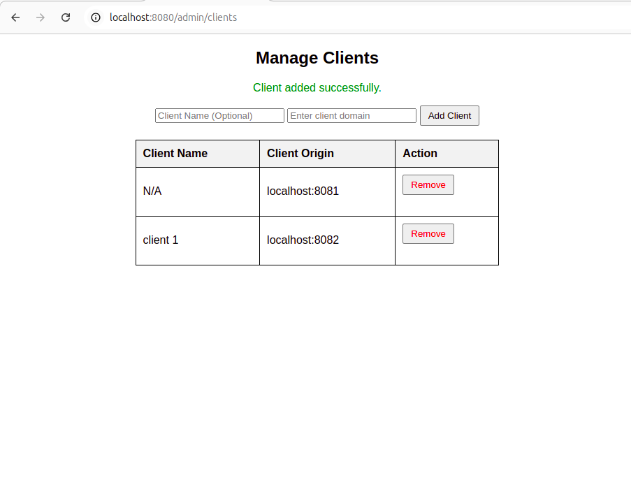
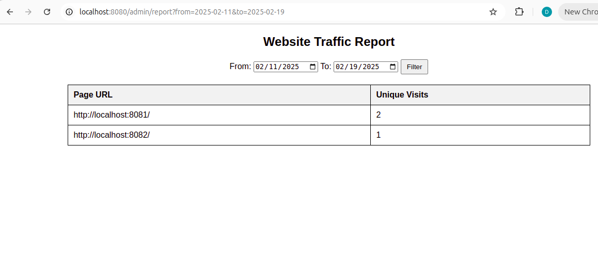
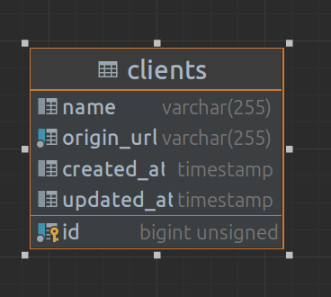
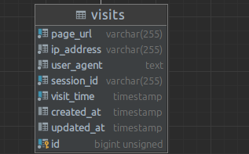

## Introduction
    The project was created using Laravel 11 and php8.2 and sail because it comes with docker development environment
    The user interface is made using Laravel templating engine, blade

## Setup:

<code>docker run --rm
-u "$(id -u):$(id -g)"
-v $(pwd):/var/www/html
-w /var/www/html laravelsail/php82-composer:latest
composer install --ignore-platform-reqs <code/>
cp .env .env.example

./vendor/bin/sail up
./vendor/bin/sail artisan migrate

The project will run on localhost:8080

## Components: 
- JS script that tracks website traffic for whitelisted clients
   - can be found at  /public/js/tracker.js
   - will be served at http://localhost:8080/js/tracker.js and publicly available if deployed on a real server
   - to be used the clients will have to add  on their html page
- Admin pannel to whitelist clients (accessible on http://localhost:8080/admin/clients)
  
   - this is simple page where clients can be whitelisted
         - name is optional
         - origin is mandatory
   - only whitelisted clients/ origins will be able to use the tracker.js script
- Reports page where unique visits and page url are displayed

  - only whitelisted origins will be shown here
  - accessible on http://localhost:8080/admin/report
  - contains date filters for ease of use 

## Database Schema:
 
 
  
 Each table has its own migration found in /database/migrations